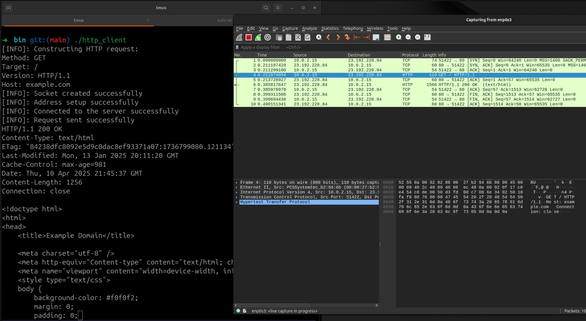
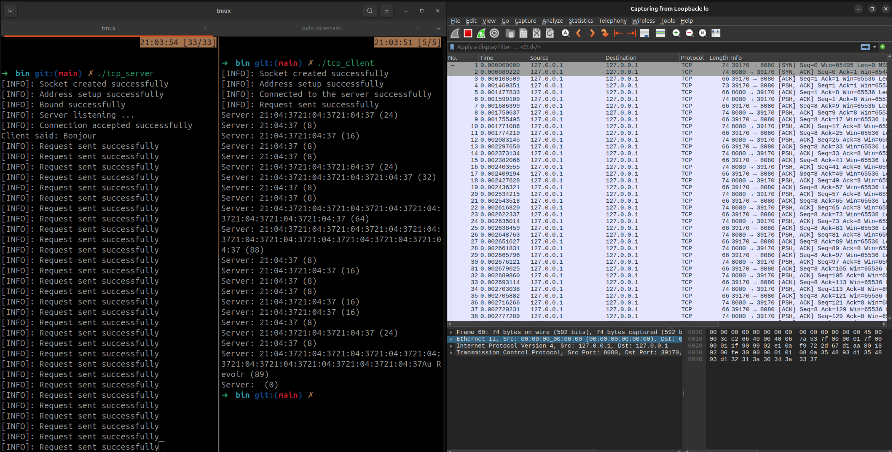
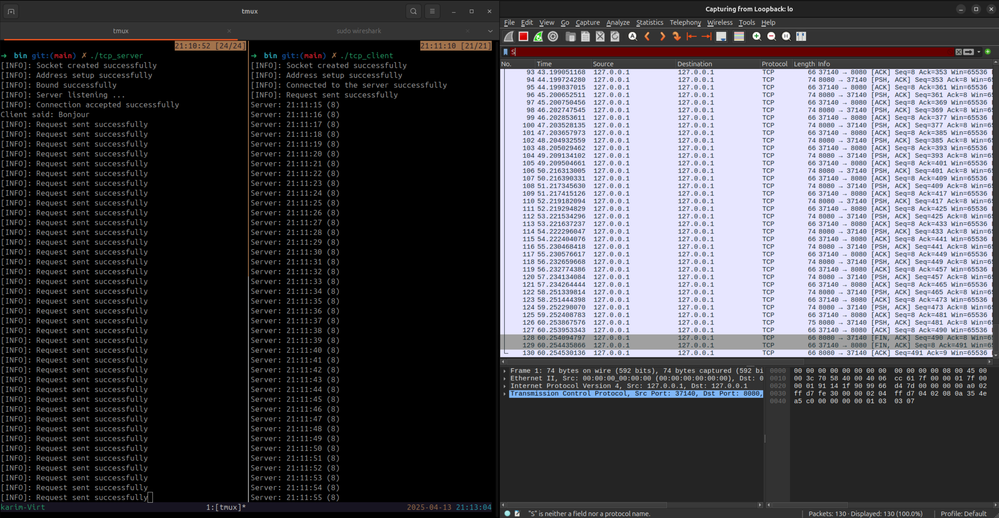

# TP Client/Serveur – GL2 : Utilisation de l’interface sockets pour des communications TCP/UDP de type client/serveur

## Reseau et telecommunication

## Realisé par: Karim Khili - Louay Chatti GL2/3
## Date of submission

---

### 1. **Introduction**

Dans le cadre de ce projet, nous avons exploré les principes de la communication réseau à travers la mise en œuvre d’applications utilisant l’interface des sockets. 

L’objectif principal était de comprendre et de développer différentes architectures Client/Serveur en s’appuyant sur des protocoles de communication en mode connecté et non connecté. 

À travers ce travail, nous avons notamment réalisé un client HTTP, étudié le fonctionnement et le développement d’applications Client/Serveur dans les deux modes de communication, et mis en place un serveur capable de traiter de manière concurrente les requêtes de plusieurs clients. 

---

### 2. **Guide de l'utilisateur : Construction et Exécution du Projet**

Les implémentations des programmes Client et Serveur sont disponibles dans le répertoire `./test`. Nous avons regroupées les sections de code redondantes dans une bibliothèque statique dont le code source se trouve dans le répertoire `./src`, tandis que ses fichiers d'en-tête sont situés dans le répertoire `./include`.

Vous pouvez soit utiliser les binaires précompilés disponibles dans le dossier `./bin`, soit construire le projet à partir des sources en suivant les étapes ci-dessous.

---

#### **Construction du Projet à Partir des Sources**

Avant de commencer, assurez-vous que les outils suivants sont installés sur votre système :

1. **CMake** : Utilisé pour configurer et générer les fichiers de construction.
2. **GCC/Clang** : Un compilateur C/C++ pour compiler le code source.
3. **Make** : Un outil de construction pour exécuter les instructions générées par CMake.

Ensuite, procédez comme suit :

1. **Créer un répertoire de construction** :
    ```bash
    mkdir build
    ```

2. **Accéder au répertoire de construction** :
    ```bash
    cd build
    ```

3. **Configurer le projet avec CMake** :
    ```bash
    cmake ..
    ```

4. **Compiler le projet** :
    ```bash
    make
    ```

---

#### **Résultats de la Construction**

- Les exécutables générés seront disponibles dans le dossier `./build/bin`.
- La bibliothèque statique sera située dans le dossier `./build/lib`.

---

### 3. **Solutions proposées**
Étant donné l’usage intensif de l’API Socket dans les différentes composantes du projet, nous avons décidé d’abstraire les opérations de bas niveau liées à la gestion des sockets. Pour cela, nous avons introduit une structure appelée `Endpoint`, définie dans le fichier `./include/endpoint.h` comme suit :

```c
struct Endpoint{
    int sockfd;
    Protocol protocol; // (*)
    char* hostname; 
    char* ip_address;
    int port;
    struct sockaddr_in* address;  
};

// (*) Protocol est un enum defini dans include/utils.h par:
typedef enum{
    NONE=0,
    TCP=1,
    UDP=2
} Protocol;
```

Cette structure, qu'il s'agisse d'un client ou d'un serveur, représente un point de communication. Elle regroupe le descripteur de socket ainsi que l'adresse associée, offrant une abstraction claire et centralisée. Cela simplifie les opérations répétitives et réduit les erreurs fréquentes liées à la manipulation directe des sockets.

Pour une documentation complète des fonctions développées autour de cette structure, veuillez consulter le fichier `./Documentation.md`. Ces fonctions encapsulent la gestion des erreurs, ce qui décharge l'utilisateur de cette complexité. Elles rendent ainsi le code plus lisible, modulaire et réutilisable.

Cette approche unifiée s'applique aussi bien aux protocoles TCP qu'UDP, garantissant une cohérence et une intégration facile dans les différentes parties du projet.

---

### 4. **Programmes Client/Serveur**

#### 1. **Client HTTP**

L'implémentation du client HTTP se trouve dans le fichier `./test/http_client/http_client.c`. Ce client est conçu pour établir une connexion avec un serveur HTTP, envoyer une requête, et afficher la réponse reçue.

---

##### **Manipulation**



###### Comment s’établit la connexion au niveau HTTP?
HTTP peut fonctionner de deux manières :
- **HTTP/1.0** : chaque requête = une nouvelle connexion TCP
- **HTTP/1.1 et HTTP/2** : connexions **persistantes** par défaut (utilisation du header `Connection: keep-alive`)

###### Comment s’établit la connexion au niveau TCP?: le **three-way handshake**
1. **Client → Serveur :** envoie un paquet **SYN** (synchronize)
2. **Serveur → Client :** répond avec un **SYN-ACK**
3. **Client → Serveur :** renvoie un **ACK**


- Après ces trois échanges, la connexion TCP est établie.

---

###### Qui décide de fermer la connexion ? 
Niveau HTTP:
- **Le client** peut fermer après avoir reçu la réponse.
- **Le serveur** peut fermer après un timeout (ex : `keep-alive timeout`) (client specifie)

Niveau TCP :
Fermeture en **four-way handshake** :
1. Un des deux (souvent **le serveur** dans HTTP/1.1 après un timeout) envoie un paquet **FIN**
2. L’autre répond **ACK**
3. L’autre envoie à son tour **FIN**
4. Réponse finale **ACK**

---

###### Quels ports sont utilisés ?
- **Serveur :** ports bien connus
  - **HTTP :** port **80**
  - **HTTPS :** port **443**
- **Client :** port **éphémère** (automatiquement choisi par le SE, ex : 49152–65535)

---

#### 2. **Communication en mode connecté (TCP)**

- Les implémentations des clients et serveurs TCP se trouvent dans le dossier `./test/mode_connecte_tcp`.

---

##### **Manipulation**

- Sans `sleep`:


- Avec `sleep`:


###### Comptage des messages reçues

Les segments TCP ne correspondent pas nécessairement aux appels `send()` ou `write()` effectués sur le socket. En effet, TCP est un protocole **orienté flux**, et non **orienté message**. Cela signifie qu'il peut :

- **Fragmenter** un seul appel à `write()` en plusieurs segments TCP.
- **Fusionner** plusieurs appels successifs à `write()` dans un seul segment (en raison de l'algorithme de Nagle, du buffering, etc.).

Pour préserver la structure des messages dans une communication TCP, il est nécessaire d'implémenter une méthode de **délimitation**. Voici quelques approches courantes :

1. **Utilisation d'un délimiteur** :
    - Ajouter un caractère ou une séquence spécifique (par exemple : `\n`) à la fin de chaque message pour indiquer sa fin.

2. **En-tête avec la taille du message** :
    - Inclure un en-tête au début de chaque message, spécifiant la taille du message à suivre. Cela permet au récepteur de savoir combien d'octets lire pour reconstituer le message complet.

Ces techniques permettent de garantir que les messages sont correctement interprétés, même si TCP segmente ou fusionne les données transmises.

---

###### Que se passe t-il si vous débranchez le câble réseau?

- **Débranchement physique** :
    - Lorsque le lien réseau est physiquement coupé, le programme ne détecte pas immédiatement la déconnexion.
    - TCP met un certain temps à détecter une déconnexion, en s'appuyant sur des mécanismes tels que les timeouts et les retransmissions.
    - Les appels `recv()` peuvent :
        - Bloquer indéfiniment.
        - Retourner une erreur après un certain temps (par exemple, `ETIMEDOUT`, `ECONNRESET`, etc.).

- **Débranchement et rebranchement rapide** :
    - Si le câble réseau est rebranché rapidement et que le système conserve les connexions, la communication peut reprendre normalement.
    - Cependant, si le serveur ou le client a tenté d'envoyer des données pendant la coupure, une erreur de socket peut survenir, entraînant la fermeture de la connexion.

---

###### **Pouvez-vous avec votre implémentation actuelle servir plusieurs clients?**

Oui, notre implémentation permet de servir plusieurs clients. Cependant, les connexions sont traitées de manière séquentielle. Cela signifie que lorsque le serveur termine une connexion avec un client, il peut alors commencer une nouvelle connexion avec un autre client.

#### **Que se passe-t-il si vous lancez un client supplémentaire alors que la file est pleine?**
Si un client supplémentaire est lancé alors que la file d'attente est pleine, sa connexion sera rejetée par le serveur. Cela se produit parce que le serveur ne peut pas accepter plus de connexions que la limite définie par le backlog.

---

#### 3. **Communication en mode non connecté (UDP)** :

- Les implémentations des client et serveur UDP se trouvent dans le dossier `./test/mode_non_connecte_udp`.
- Contrairement aux communications en mode connecté (TCP), les communications en mode non connecté (UDP) ne nécessitent pas que le serveur écoute ou accepte des connexions. De même, le client n'a pas besoin d'établir une connexion préalable avec le serveur.

---

##### **Manipulation**


###### Comptage des messages reçues

Si le serveur envoie rapidement une grande quantité de messages, certains peuvent être perdus dans les cas suivants :
- Le client ne lit pas assez vite.
- La taille du buffer de réception (`SO_RCVBUF`) est dépassée.

Donc, il y a des pertes de messages.

---

### Observation avec Wireshark: Segments UDP = Messages envoyés ?
**Oui** : Chaque appel à `sendto()` (ou `sendmsg()`) génère un datagramme UDP unique.  
De même, chaque appel à `recvfrom()` lit exactement un datagramme.

- **UDP préserve les limites des messages** :  
    UDP est **orienté message** (message-based), contrairement à TCP qui est **orienté flux** (stream-based).  
    En UDP, chaque message correspond à un datagramme que vous pouvez observer tel quel dans Wireshark.

- **Pas de regroupement ni de découpage** :  
    Contrairement à TCP, UDP ne regroupe pas plusieurs messages dans un seul segment ni ne fragmente un message en plusieurs segments.

---

###### Que se passe t-il si vous débranchez le câble réseau?

- **UDP ne détecte aucune connexion**, donc :
    - Si vous envoyez des messages après avoir débranché le câble, ils sont simplement **perdus**.
    - Le programme continue de fonctionner comme si de rien n'était ; il n'y a pas d'erreur immédiate lors de l'envoi.
    - La fonction `recvfrom()` ne reçoit rien et soit **bloque**, soit retourne `-1` si le socket est en mode non-bloquant.

- **Scénario de débranchement/rebranchement rapide** :
    - Si le lien est rétabli rapidement, la communication peut reprendre sans problème.
    - Étant donné qu'UDP ne maintient aucun état, il ne nécessite aucune "reconnexion."

---

###### **Pouvez-vous avec votre implémentation actuelle servir plusieurs clients ?**

En UDP, aucune connexion persistante n’est établie.
Le serveur reçoit simplement des datagrammes venant d’adresses différentes.
Donc oui, le serveur peut naturellement servir plusieurs clients.

**Avantages :**
- Pas de file d’attente de connexions comme en TCP (listen() n’existe pas en UDP).
- Le serveur peut traiter plusieurs clients séquentiellement ou en parallèle, simplement en identifiant l’adresse (IP:port) dans `recvfrom()`.

**Limite :**
- Il faut que le serveur traite assez vite les paquets, sinon le buffer d’entrée peut déborder.

---

#### 4. **Communication en mode concurrent** :

##### 1. **Concurrence Mono-Service**

- L'implémentation du serveur TCP concurrent se trouve dans le dossier `./test/mode_concurrent/mono_service`.

- Dans ce mode, le serveur est conçu pour gérer plusieurs connexions clients simultanément, mais tous les clients utilisent le même service (un service de temps). 

- **Mécanisme utilisé** : Cela est réalisé en utilisant un appel système `fork`. À chaque nouvelle connexion client, le processus parent crée un processus enfant via `fork`. Le processus enfant est chargé de gérer la communication avec ce client spécifique, tandis que le processus parent continue d'écouter et d'accepter de nouvelles connexions.

###### Que constatez-vous par rapport à l’écoulement du temps si le nombre de clients est important ? 
- Si le nombre de connexions simultanées devient très élevé, cela peut entraîner une surcharge importante des ressources système (mémoire et CPU).

---

##### **4.2. Concurrence Multi-Service**

Dans ce mode, le serveur est capable de gérer plusieurs services différents simultanément. Chaque service est associé à un port ou à un type de requête spécifique.

###### **Implémentation avec Multiplexage**

1. **Utilisation de `select`** :
    - Le serveur utilise un mécanisme de multiplexage, comme l'appel système `select`, pour surveiller plusieurs sockets en même temps. Cela permet au serveur de détecter les sockets prêts à lire ou à écrire sans bloquer l'exécution.
    - Chaque socket peut être associé à un service spécifique, ce qui permet de gérer plusieurs types de requêtes ou services sur un seul serveur.

2. **Gestion des services** :
    - Chaque service est traité dans une fonction distincte. Par exemple, un service peut être dédié à fournir l'heure, tandis qu'un autre peut gérer des requêtes de calcul.
    - Le serveur utilise une boucle principale pour surveiller les événements sur les sockets et déléguer les requêtes aux fonctions appropriées en fonction du type de service demandé.

- **Avantages** :
  - Consommation de ressources plus faible par rapport à l'approche basée sur `fork`, car un seul processus gère toutes les connexions.