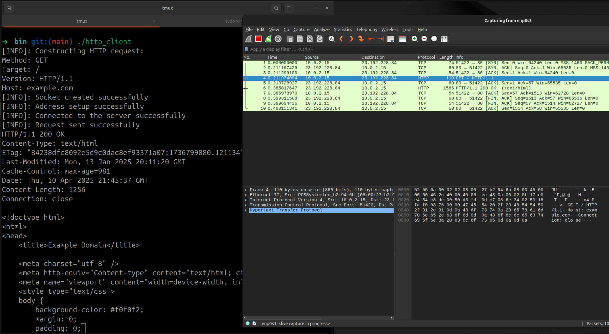
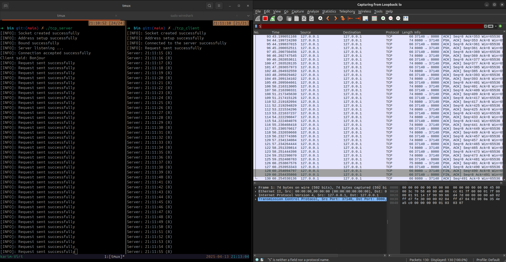

# TP Client/Serveur – GL2 : Utilisation de l’interface sockets pour des communications TCP/UDP de type client/serveur

## Reseau et telecommunication

## Realisé par: Karim Khili - Louay Chatti GL2/3
## Date of submission

---

### 1. **Introduction**

Dans le cadre de ce projet, nous avons exploré les principes de la communication réseau à travers la mise en œuvre d’applications utilisant l’interface des sockets. 

L’objectif principal était de comprendre et de développer différentes architectures Client/Serveur en s’appuyant sur des protocoles de communication en mode connecté et non connecté. 

À travers ce travail, nous avons notamment réalisé un client HTTP, étudié le fonctionnement et le développement d’applications Client/Serveur dans les deux modes de communication, et mis en place un serveur capable de traiter de manière concurrente les requêtes de plusieurs clients. 

---

### 2. **Guide de l'utilisateur : Construction et Exécution du Projet**

Les implémentations des programmes Client et Serveur sont disponibles dans le répertoire `./test`. Nous avons regroupées les sections de code redondantes dans une bibliothèque statique dont le code source se trouve dans le répertoire `./src`, tandis que ses fichiers d'en-tête sont situés dans le répertoire `./include`.

Vous pouvez soit utiliser les binaires précompilés disponibles dans le dossier `./bin`, soit construire le projet à partir des sources en suivant les étapes ci-dessous.

---

#### **Construction du Projet à Partir des Sources**

Avant de commencer, assurez-vous que les outils suivants sont installés sur votre système :

1. **CMake** : Utilisé pour configurer et générer les fichiers de construction.
2. **GCC/Clang** : Un compilateur C/C++ pour compiler le code source.
3. **Make** : Un outil de construction pour exécuter les instructions générées par CMake.

Ensuite, procédez comme suit :

1. **Créer un répertoire de construction** :
    ```bash
    mkdir build
    ```

2. **Accéder au répertoire de construction** :
    ```bash
    cd build
    ```

3. **Configurer le projet avec CMake** :
    ```bash
    cmake ..
    ```

4. **Compiler le projet** :
    ```bash
    make
    ```

---

#### **Résultats de la Construction**

- Les exécutables générés seront disponibles dans le dossier `./build/bin`.
- La bibliothèque statique sera située dans le dossier `./build/lib`.

---

### 3. **Solutions proposées**
- Show a diagram if helpful (e.g., class diagram, flowchart, etc.).

Étant donné l’usage intensif de l’API Socket dans les différentes composantes du projet, nous avons décidé d’abstraire les opérations de bas niveau liées à la gestion des sockets. Pour cela, nous avons introduit une structure appelée `Endpoint`, définie dans le fichier `./include/endpoint.h` comme suit :

```c
struct Endpoint{
    int sockfd;
    Protocol protocol; // (*)
    char* hostname; 
    char* ip_address;
    int port;
    struct sockaddr_in* address;  
};

// (*) Protocol est un enum defini dans include/utils.h par:
typedef enum{
    NONE=0,
    TCP=1,
    UDP=2
} Protocol;
```

Cette structure représente un point de communication, qu’il soit client ou serveur. Elle regroupe le descripteur de socket ainsi que l’adresse associée. L’objectif de cette abstraction est de centraliser et simplifier les opérations répétitives et souvent sujettes à erreurs liées à la manipulation directe des sockets.

Autour de cette structure, nous avons défini une série de fonctions permettant de :

- Créer un `Endpoint` ;
```c
/**
 * Crée un nouvel `Endpoint` représentant un point de communication réseau.
 * Cette fonction peut être utilisée par:
 *      - un serveur pour définir l'endpoint auquel se lier (bind_to / listen_to) 
 *      - un client pour définir l'endpoint auquel se connecter (connect_to).
 *
 * @param protocol Le protocole de communication (TCP ou UDP).
 * @param hostname Le nom d'hôte (peut être NULL si l'adresse IP est spécifiée).
 * @param ip_address L'adresse IP (peut être NULL si le nom d'hôte est spécifié).
 * @param port Le numéro de port associé à l'endpoint.
 * @return Un pointeur vers une structure `Endpoint` initialisée.
 *
 * @note Cette fonction est implémentée dans le fichier `../src/endpoint.c`.
 */
struct Endpoint* create_endpoint(Protocol protocol, char* hostname, char* ip_address, int port);

// Exemple d'utilisation : (`./test/http_client/http_client.c`)
struct Endpoint* client = create_endpoint(TCP, "example.com", NULL, 80); 
// Ce client HTTP cible la page web example.com sur le port 80.
```

- Lier (`bind`) un `Endpoint` à une adresse locale ;
```c
/**
 * Cette fonction est généralement utilisée par un serveur (TCP ou UDP) pour lier un descripteur
 * de socket (`Endpoint.sockfd`) à une adresse locale et un port spécifiés `Endpoint.address`.
 * Le processus de liaison associe le socket à l'adresse spécifiée, le rendant prêt à écouter
 * les connexions entrantes ou à envoyer/recevoir des données.
 *
 * @param server Un pointeur vers la structure `Endpoint` contenant :
 *               - `sockfd` : Le descripteur de socket à lier.
 *               - `address` : L'adresse locale et le port auxquels lier le socket.
 *
 * @note Cette fonction est implémentée dans le fichier `./src/server.c`.
 * @note Le `Endpoint` doit être correctement initialisé avant d'appeler cette fonction.
 *       Assurez-vous que le `sockfd` est valide et que le champ `address` contient
 *       les informations d'adresse et de port souhaitées.
 *       
 *
 * @warning Si la liaison échoue (par exemple, en raison d'une adresse déjà utilisée ou invalide),
 *          la fonction termine le programme.
 */
void bind_to(struct Endpoint* server);

// Exemple d'utilisation : (`./test/mode_connecte_tcp/tcp_server.c`)
struct Endpoint* server = create_endpoint(TCP, NULL, "127.0.0.1", 8080);
bind_to(server);
```

- `connect_to` permet à un Endpoint client de se connecter à un Endpoint serveur ;
```c
/**
 * Cette fonction est généralement utilisée par un client TCP pour connecter le champ `sockfd` 
 * de la structure `Endpoint` au champ `address`.
 *
 * @note Cette fonction est implémentée dans le fichier `./src/client.c`.
 * @note L'`Endpoint` doit être correctement initialisé avant d'appeler cette fonction.
 *       Assurez-vous que le `sockfd` est valide et que le champ `address` contient
 *       les informations d'adresse et de port souhaitées.
 *
 * @details Cette fonction utilise la structure `Endpoint` pour établir une connexion
 *          en liant le champ `sockfd` au champ `address` (sockaddr).
 *
 * @warning Si la connexion échoue (par exemple, en raison d'une adresse déjà utilisée
 *          ou invalide), la fonction termine le programme.
 */
void connect_to(struct Endpoint* client);

// Exemple d'utilisation : (`./test/mode_connecte_tcp/tcp_server.c`)
struct Endpoint* client = create_endpoint(TCP, "example.com", NULL, 80);
connect_to(client);
```

- Mettre un Endpoint en écoute (`listen_to`) ;
```c
/**
 * Cette fonction est utilisée par un serveur TCP pour mettre un `Endpoint` en écoute.
 * 
 * @details Cette fonction appelle d'abord `bind_to` sur l'`Endpoint` fourni pour lier le socket
 *          à l'adresse locale spécifiée. Dans le cas d'un serveur TCP (`Endpoint.protocol == TCP`),
 *          elle tente ensuite de mettre le socket (`Endpoint.sockfd`) en mode écoute sur l'adresse
 *          et le port spécifiés dans `Endpoint.address` (sockaddr).
 *
 * @param server Un pointeur vers la structure `Endpoint` représentant le serveur.
 *
 * @note Cette fonction est implémentée dans le fichier `./src/server.c`.
 * @note Cette fonction inclut implicitement un appel à `bind_to` pour lier le socket 
 *       à l'adresse locale spécifiée.
 * @note L'`Endpoint` doit être correctement initialisé avant d'appeler cette fonction.
 *       Assurez-vous que le `sockfd` est valide et que le champ `address` contient
 *       les informations d'adresse et de port souhaitées.
 *
 * @warning Si une étape échoue (par exemple, en raison d'une adresse déjà utilisée
 *          ou invalide), la fonction termine le programme.
 */
void listen_to(struct Endpoint* server);

// Exemple d'utilisation : (`./test/mode_connecte_tcp/tcp_server.c`)
struct Endpoint* server = create_endpoint(TCP, NULL, "127.0.0.1", 8080);
listen_to(server); // Appel implicit à bind_to
```

- Accepter des connexions entrantes (`accept_connexion`) à partir d’un `Endpoint` ;
```c
/**
 * Cette fonction est utilisée par un serveur TCP pour accepter les connexions
 * des clients après avoir commencé à écouter sur le socket. (`Endpoint.sockfd`)
 *
 * @param server Un pointeur vers la structure `Endpoint` représentant le serveur.
 *
 * @return Une structure `Endpoint` représentant le client accepté pour la connexion.
 *
 * @note Cette fonction est implémentée dans le fichier `./src/server.c`.
 * @note L'`Endpoint` du serveur doit être correctement initialisé avant d'appeler
 *       cette fonction. Assurez-vous que le `sockfd` est valide et que le champ
 *       `address` contient les informations d'adresse et de port souhaitées.
 *
 * @warning Si une étape échoue (par exemple, en raison d'une adresse déjà utilisée
 *          ou invalide), la fonction termine le programme.
 */
struct Endpoint* accept_connexion(struct Endpoint* server);

// Exemple d'utilisation : (`./test/mode_connecte_tcp/tcp_server.c`)
struct Endpoint* server = create_endpoint(TCP, NULL, "127.0.0.1", 8080);
listen_to(server);
struct Endpoint* client = accept_connexion(server);
```

- Envoyer des messages via la fonction `send_to` ;
```c
/**
 * Cette fonction est utilisée par un client ou un serveur pour envoyer un message
 * à un autre point de communication. Elle prend en charge les communications TCP
 * (via `send`) et UDP (via `sendto`) en fonction du champ `destination->protocol`.
 *
 * @param destination Un pointeur vers la structure `Endpoint` représentant le destinataire.
 * @param message Le message à envoyer sous forme de chaîne de caractères.
 *
 * @note Cette fonction est implémentée dans le fichier `./src/endpoint.c`.
 * @note L'`Endpoint` doit être correctement initialisé avant d'appeler cette fonction.
 *       Assurez-vous que le `sockfd` est valide et que le champ `address` contient
 *       les informations d'adresse et de port souhaitées.
 *
 * @warning Si une étape échoue (par exemple, en raison d'une adresse invalide ou
 *          d'une erreur réseau), la fonction termine le programme.
 */
void send_to(struct Endpoint* destination, const char* message);

// Exemple d'utilisation : (`./test/mode_non_connecte_udp/udp_server.c`)
struct Endpoint* serveur = create_endpoint(UDP, NULL, "127.0.0.1", 8080);
send_to(serveur, "Hello");
```

- Recevoir des messages via la fonction `receive_from` ;
```c
/**
 * Cette fonction peut être utilisée par un client ou un serveur pour recevoir un message
 * envoyé à son adresse (`Endpoint.address`). Elle prend en charge les communications TCP
 * (via `recv`) et UDP (via `recvfrom`) en fonction du champ `source->protocol`.
 *
 * @param source Un pointeur vers la structure `Endpoint` représentant la source du message.
 *
 * @return Une chaîne de caractères contenant le message reçu. La mémoire allouée pour
 *         le message doit être libérée par l'appelant après utilisation.
 *
 * @note Cette fonction est implémentée dans le fichier `./src/endpoint.c`.
 * @note L'`Endpoint` doit être correctement initialisé avant d'appeler cette fonction.
 *       Assurez-vous que le `sockfd` est valide et que le champ `address` contient
 *       les informations d'adresse et de port souhaitées.
 *
 * @warning Si une étape échoue (par exemple, en raison d'une adresse invalide ou
 *          d'une erreur réseau), la fonction termine le programme.
 */
char* receive_from(struct Endpoint* source);

// Exemple d'utilisation : (`./test/mode_non_connecte_udp/udp_server.c`)
struct Endpoint* server = create_endpoint(UDP, NULL, "127.0.0.1", 8080);
struct Endpoint* client = create_udp_client(server);
bind_to(server);
char* request = receive_from(client);
```

- Fermer proprement un `Endpoint`.
```c
/**
 * Cette fonction est utilisée pour libérer les ressources associées à un `Endpoint`.
 * Elle ferme le socket associé et libère la mémoire allouée pour l'adresse du socket
 * (`Endpoint.address`).
 *
 * @param endpoint Un pointeur vers la structure `Endpoint` à libérer.
 *
 * @note Cette fonction est implémentée dans le fichier `../src/endpoint.c`.
 * @note Assurez-vous que le `sockfd` est valide avant de le fermer.
 */
void free_endpoint(struct Endpoint* endpoint);

// Exemple d'utilisation :
struct Endpoint* server = create_endpoint(UDP, NULL, "127.0.0.1", 8080);
free_endpoint(server);
```

Ces fonctions encapsulent la logique de gestion des erreurs, ce qui permet de soulager l’utilisateur de cette complexité dans le reste du code. Cette approche unifiée rend le code plus lisible, modulaire, et réutilisable dans les différentes parties du projet, que ce soit pour le protocole TCP ou UDP.

---

### 4. **Programmes Client/Serveur**
- Include screenshots of outputs if needed or a small sample of inputs/outputs.

#### 1. **Client HTTP**

L'implémentation du client HTTP se trouve dans le fichier `./test/http_client/http_client.c`. Ce client est conçu pour établir une connexion avec un serveur HTTP, envoyer une requête, et afficher la réponse reçue.

---

##### **Manipulation**



###### Comment s’établit la connexion au niveau HTTP?
HTTP peut fonctionner de deux manières :
- **HTTP/1.0** : chaque requête = une nouvelle connexion TCP
- **HTTP/1.1 et HTTP/2** : connexions **persistantes** par défaut (utilisation du header `Connection: keep-alive`)

###### Comment s’établit la connexion au niveau TCP?: le **three-way handshake**
1. **Client → Serveur :** envoie un paquet **SYN** (synchronize)
2. **Serveur → Client :** répond avec un **SYN-ACK**
3. **Client → Serveur :** renvoie un **ACK**

> Après ces trois échanges, la connexion TCP est établie.

---

###### Qui décide de fermer la connexion ? 
> Niveau HTTP:
- **Le client** peut fermer après avoir reçu la réponse.
- **Le serveur** peut fermer après un timeout (ex : `keep-alive timeout`) (client specifie)

> Niveau TCP :
Fermeture en **four-way handshake** :
1. Un des deux (souvent **le serveur** dans HTTP/1.1 après un timeout) envoie un paquet **FIN**
2. L’autre répond **ACK**
3. L’autre envoie à son tour **FIN**
4. Réponse finale **ACK**

---

###### Quels ports sont utilisés ?
- **Serveur :** ports bien connus
  - **HTTP :** port **80**
  - **HTTPS :** port **443**
- **Client :** port **éphémère** (automatiquement choisi par le SE, ex : 49152–65535)

---

#### 2. **Communication en mode connecté (TCP)**

- Les implémentations des clients et serveurs TCP se trouvent dans le dossier `./test/mode_connecte_tcp`.

---

##### **Manipulation**

- Sans delay:


- Avec retard:


###### Comptage des messages reçues

Les segments TCP ne correspondent pas nécessairement aux appels `send()` ou `write()` effectués sur le socket. En effet, TCP est un protocole **orienté flux**, et non **orienté message**. Cela signifie qu'il peut :

- **Fragmenter** un seul appel à `write()` en plusieurs segments TCP.
- **Fusionner** plusieurs appels successifs à `write()` dans un seul segment (en raison de l'algorithme de Nagle, du buffering, etc.).

Pour préserver la structure des messages dans une communication TCP, il est nécessaire d'implémenter une méthode de **délimitation**. Voici quelques approches courantes :

1. **Utilisation d'un délimiteur** :
    - Ajouter un caractère ou une séquence spécifique (par exemple : `\n`) à la fin de chaque message pour indiquer sa fin.

2. **En-tête avec la taille du message** :
    - Inclure un en-tête au début de chaque message, spécifiant la taille du message à suivre. Cela permet au récepteur de savoir combien d'octets lire pour reconstituer le message complet.

Ces techniques permettent de garantir que les messages sont correctement interprétés, même si TCP segmente ou fusionne les données transmises.

---

###### Que se passe t-il si vous débranchez le câble réseau?

- **Débranchement physique** :
    - Lorsque le lien réseau est physiquement coupé, le programme ne détecte pas immédiatement la déconnexion.
    - TCP met un certain temps à détecter une déconnexion, en s'appuyant sur des mécanismes tels que les timeouts et les retransmissions.
    - Les appels `recv()` peuvent :
        - Bloquer indéfiniment.
        - Retourner une erreur après un certain temps (par exemple, `ETIMEDOUT`, `ECONNRESET`, etc.).

- **Débranchement et rebranchement rapide** :
    - Si le câble réseau est rebranché rapidement et que le système conserve les connexions, la communication peut reprendre normalement.
    - Cependant, si le serveur ou le client a tenté d'envoyer des données pendant la coupure, une erreur de socket peut survenir, entraînant la fermeture de la connexion.

---

###### **Pouvez-vous avec votre implémentation actuelle servir plusieurs clients ?**

Oui, notre implémentation permet de servir plusieurs clients. Cependant, les connexions sont traitées de manière séquentielle. Cela signifie que lorsque le serveur termine une connexion avec un client, il peut alors commencer une nouvelle connexion avec un autre client.

#### **Que se passe-t-il si vous lancez un client supplémentaire alors que la file est pleine ?**
Si un client supplémentaire est lancé alors que la file d'attente est pleine, sa connexion sera rejetée par le serveur. Cela se produit parce que le serveur ne peut pas accepter plus de connexions que la limite définie par le backlog.

---

#### 3. **Communication en mode non connecté (UDP)** :

- Les implémentations des client et serveur UDP se trouvent dans le dossier `./test/mode_non_connecte_udp`.
- Contrairement aux communications en mode connecté (TCP), les communications en mode non connecté (UDP) ne nécessitent pas que le serveur écoute ou accepte des connexions. De même, le client n'a pas besoin d'établir une connexion préalable avec le serveur.

---

##### **Manipulation**


###### Comptage des messages reçues

Si le serveur envoie rapidement une grande quantité de messages, certains peuvent être perdus dans les cas suivants :
- Le client ne lit pas assez vite.
- La taille du buffer de réception (`SO_RCVBUF`) est dépassée.

Donc, il y a des pertes de messages.

---

### Observation avec Wireshark: Segments UDP = Messages envoyés ?
**Oui** : Chaque appel à `sendto()` (ou `sendmsg()`) génère un datagramme UDP unique.  
De même, chaque appel à `recvfrom()` lit exactement un datagramme.

- **UDP préserve les limites des messages** :  
    UDP est **orienté message** (message-based), contrairement à TCP qui est **orienté flux** (stream-based).  
    En UDP, chaque message correspond à un datagramme que vous pouvez observer tel quel dans Wireshark.

- **Pas de regroupement ni de découpage** :  
    Contrairement à TCP, UDP ne regroupe pas plusieurs messages dans un seul segment ni ne fragmente un message en plusieurs segments.

---

###### Que se passe t-il si vous débranchez le câble réseau?

- **UDP ne détecte aucune connexion**, donc :
    - Si vous envoyez des messages après avoir débranché le câble, ils sont simplement **perdus**.
    - Le programme continue de fonctionner comme si de rien n'était ; il n'y a pas d'erreur immédiate lors de l'envoi.
    - La fonction `recvfrom()` ne reçoit rien et soit **bloque**, soit retourne `-1` si le socket est en mode non-bloquant.

- **Scénario de débranchement/rebranchement rapide** :
    - Si le lien est rétabli rapidement, la communication peut reprendre sans problème.
    - Étant donné qu'UDP ne maintient aucun état, il ne nécessite aucune "reconnexion."

---

###### **Pouvez-vous avec votre implémentation actuelle servir plusieurs clients ?**

En UDP, aucune connexion persistante n’est établie.
Le serveur reçoit simplement des datagrammes venant d’adresses différentes.
Donc oui, le serveur peut naturellement servir plusieurs clients.

**Avantages :**
- Pas de file d’attente de connexions comme en TCP (listen() n’existe pas en UDP).
- Le serveur peut traiter plusieurs clients séquentiellement ou en parallèle, simplement en identifiant l’adresse (IP:port) dans `recvfrom()`.

**Limite :**
- Il faut que le serveur traite assez vite les paquets, sinon le buffer d’entrée peut déborder.

---

#### 4. **Communication en mode concurrent** :

##### 1. **Concurrence Mono-Service**

- La implémentation du serveur TCP concurrent se trouvent dans le dossier `./test/mode_concurrent/mono_service`.

- Dans ce mode, le serveur est conçu pour gérer plusieurs connexions clients simultanément, mais tous les clients utilisent le même service (service temps). 

- Cela est réalisé en utilisant un appel système `fork` pour créer un nouveau processus à chaque connexion client. Chaque processus enfant gère la communication avec un client spécifique, tandis que le processus parent continue d'accepter de nouvelles connexions. 

###### Que constatez-vous par rapport à l’écoulement du temps si le nombre de clients est important ? 

- Cette approche peut entraîner une surcharge en termes de ressources système si le nombre de connexions simultanées est élevé.

---

##### **4.2. Concurrence Multi-Service**

Dans ce mode, le serveur est capable de gérer plusieurs services différents simultanément. Chaque service peut être associé à un port ou à un type de requête spécifique.

###### **Implémentation avec Multiplexage**

1. **Utilisation de `select` ou `poll`** :
    Le serveur utilise des mécanismes de multiplexage pour surveiller plusieurs sockets en même temps. Chaque socket peut être associé à un service spécifique.

2. **Gestion des services** :
    Chaque service est traité dans une fonction distincte.

---

### 9. **Conclusion**
- Summarize your final working solution.
- What did you learn?
- If you had more time, what would you improve?